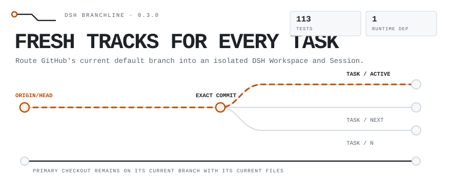
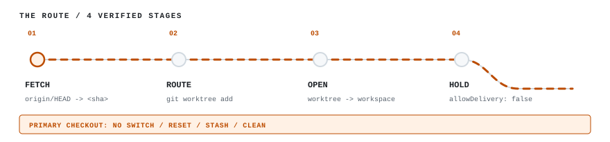
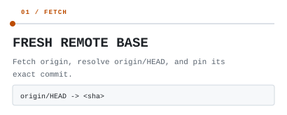
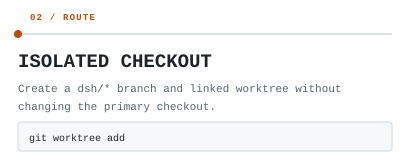
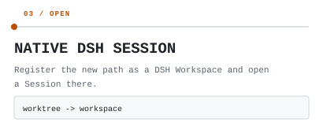
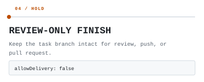

<!-- generated by scripts/readme/build.mjs. do not edit by hand. -->

<picture>
<source media="(max-width: 500px) and (prefers-color-scheme: dark)" srcset="assets/readme/masthead-narrow-dark.svg">
<source media="(max-width: 500px)" srcset="assets/readme/masthead-narrow-light.svg">
<source media="(prefers-color-scheme: dark)" srcset="assets/readme/masthead-dark.svg">

</picture>

DSH Branchline gives [DeepSeek Harness](https://github.com/deepseek-ai/deepseek-harness) a clean start for every task: fetch the remote default branch, pin its exact commit, then open an isolated worktree as a native DSH Workspace and Session.

## Install

```powershell
git clone https://github.com/ryanportfolio/dsh-branchline.git
cd dsh-branchline
.\setup.ps1
.\Start-Branchline.cmd
```

Requires Windows, Git 2.38+, Node 22.19+, and DeepSeek Harness 0.1.x. The plugin itself remains portable; the bundled control-panel launcher targets Windows PowerShell 5.1 and PowerShell 7.

## Why Branchline exists

DSH normally starts in the repository folder you select. A dirty or stale checkout is a poor base for a new coding task, so Branchline fetches `origin/HEAD`, pins its exact commit, and opens a separate linked worktree.

The unofficial [dsh-worktree](https://github.com/Eleven-is-cool/dsh-worktree) creates worktrees from local branches. Branchline also needed durable task state, validation, review, and recovery. Its task-board foundation derives from [Palaiologos1453's MIT-licensed Worktree Studio](https://github.com/Palaiologos1453/dsh-worktree-studio); the launcher and fresh-origin workflow were built for Branchline.

<picture>
<source media="(max-width: 500px) and (prefers-color-scheme: dark)" srcset="assets/readme/route-narrow-dark.svg">
<source media="(max-width: 500px)" srcset="assets/readme/route-narrow-light.svg">
<source media="(prefers-color-scheme: dark)" srcset="assets/readme/route-dark.svg">

</picture>

<table>
<tr>
<td width="50%"><a href="docs/usage.md#fresh-remote-base">
<picture>
<source media="(max-width: 500px) and (prefers-color-scheme: dark)" srcset="assets/readme/card-fresh-base-narrow-dark.svg">
<source media="(max-width: 500px)" srcset="assets/readme/card-fresh-base-narrow-light.svg">
<source media="(prefers-color-scheme: dark)" srcset="assets/readme/card-fresh-base-dark.svg">

</picture>
</a></td>
<td width="50%"><a href="docs/usage.md#isolated-checkout">
<picture>
<source media="(max-width: 500px) and (prefers-color-scheme: dark)" srcset="assets/readme/card-isolated-checkout-narrow-dark.svg">
<source media="(max-width: 500px)" srcset="assets/readme/card-isolated-checkout-narrow-light.svg">
<source media="(prefers-color-scheme: dark)" srcset="assets/readme/card-isolated-checkout-dark.svg">

</picture>
</a></td>
</tr>
<tr>
<td width="50%"><a href="docs/usage.md#native-dsh-session">
<picture>
<source media="(max-width: 500px) and (prefers-color-scheme: dark)" srcset="assets/readme/card-native-session-narrow-dark.svg">
<source media="(max-width: 500px)" srcset="assets/readme/card-native-session-narrow-light.svg">
<source media="(prefers-color-scheme: dark)" srcset="assets/readme/card-native-session-dark.svg">

</picture>
</a></td>
<td width="50%"><a href="docs/usage.md#review-only-finish">
<picture>
<source media="(max-width: 500px) and (prefers-color-scheme: dark)" srcset="assets/readme/card-review-only-narrow-dark.svg">
<source media="(max-width: 500px)" srcset="assets/readme/card-review-only-narrow-light.svg">
<source media="(prefers-color-scheme: dark)" srcset="assets/readme/card-review-only-dark.svg">

</picture>
</a></td>
</tr>
</table>

## Use

1. Start the launcher and choose any local Git repository.
2. Open **Worktree tasks** in the DSH sidebar.
3. Create a task with **Base ref** empty.
4. Work in the new DSH Session. Your primary checkout stays on its current branch with its current files.
5. Review the task, then push its dsh/* branch or open a pull request through your normal Git workflow.

## Verified surface

50 tests across 7 files · 1 runtime dependency · PowerShell 5.1 and 7 launcher self-tests · local delivery disabled by default

## Docs

- [Usage and configuration](docs/usage.md)
- [Architecture and safety model](docs/architecture.md)
- [Security policy](SECURITY.md)
- [Contributing](CONTRIBUTING.md)
- [Changelog](CHANGELOG.md)

## Licence and credit

[MIT](LICENSE). See [NOTICE](NOTICE) for the exact upstream-derived boundary and retained credit.
